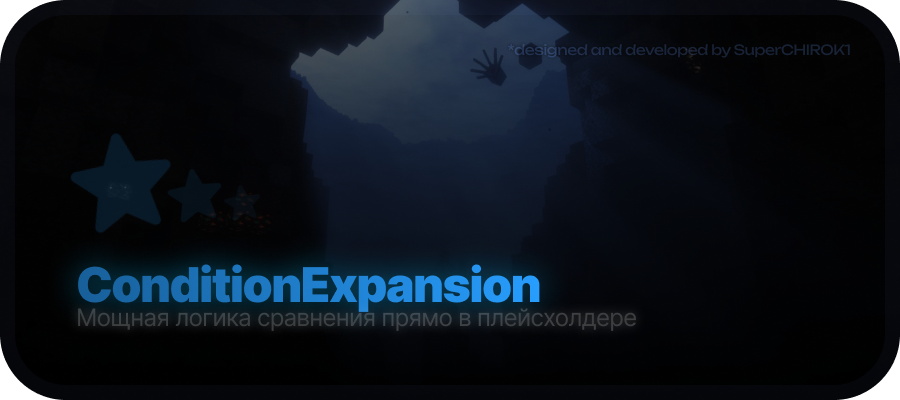

## 🐋 Преимущества:
- **Большое количество операторов и модификаторов**
- **Удобное создание и редактирование без ИСПОЛЬЗОВАНИЯ JavaScript**
- **Режим Fallback:** Позволяет вывести определенный текст, если плейсхолдер пуст
- **Режим Switch**: Позволяет вывести текст на основе сравнения значения с несколькими вариантами
- *не даёт утекать памяти, как JavaScript расширение*

## 📘 Операторы

| Оператор | Описание                      |
|:---------|:------------------------------|
| `==`     | Равно                         |
| `!=`     | Не равно                      |
| `>`      | Больше                        |
| `<`      | Меньше                        |
| `>=`     | Больше или равно              |
| `<=`     | Меньше или равно              |
| `==!`    | Равно (игнорируя регистр)     |
| `~~=`    | Содержит (contains)           |
| `$=`     | Начинается с.. (startsWith)   |
| `#=`     | Заканчивается на.. (endsWith) |
| `@=`     | Содержит символ               |

## 🌠 Обсуждения на форумах
Здесь вы сможете найти примеры работы плейсхолдеров или узнать формат того или иного режима.

- [**🔷 SpigotMC.ru**](https://spigotmc.ru/resources/5087/)
- [**🔷 Black-Minecraft.com**](https://black-minecraft.com/resources/10416/)

